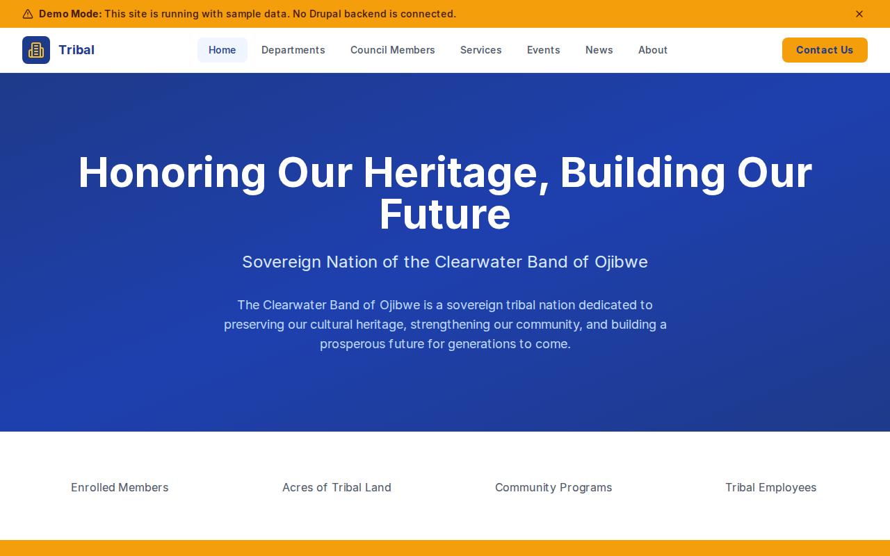

# Decoupled Tribal

A tribal nation government website starter for Decoupled Drupal + Next.js. Built for federally recognized tribal nations, bands, and indigenous communities to provide sovereign governance information, member services, cultural preservation resources, and community engagement.



## Features

- **Departments** - Tribal government departments with contact info, office hours, and program details
- **Council Members** - Elected tribal council leaders with bios, positions, districts, and term dates
- **Tribal Services** - Member services including healthcare, housing assistance, language programs, and elder care
- **Events** - Community events, cultural celebrations, powwows, and youth programs with public/members-only designation
- **News** - Tribal nation news, government updates, health announcements, and cultural stories
- **Modern Design** - Clean, respectful UI with warm earth tones honoring indigenous heritage

## Quick Start

### 1. Clone the template

```bash
npx degit nickstoneman/decoupled-tribal my-tribal-nation
cd my-tribal-nation
npm install
```

### 2. Run interactive setup

```bash
npm run setup
```

This interactive script will:
- Authenticate with Decoupled.io (opens browser)
- Create a new Drupal space
- Wait for provisioning (~90 seconds)
- Configure your `.env.local` file
- Import sample content

### 3. Start development

```bash
npm run dev
```

Visit [http://localhost:3000](http://localhost:3000)

---

## Manual Setup

If you prefer to run each step manually:

<details>
<summary>Click to expand manual setup steps</summary>

### Authenticate with Decoupled.io

```bash
npx decoupled-cli@latest auth login
```

### Create a Drupal space

```bash
npx decoupled-cli@latest spaces create "My Tribal Nation"
```

Note the space ID returned (e.g., `Space ID: 1234`). Wait ~90 seconds for provisioning.

### Configure environment

```bash
npx decoupled-cli@latest spaces env 1234 --write .env.local
```

### Import content

```bash
npm run setup-content
```

This imports:
- Homepage with hero, statistics, and member services CTA
- 3 Departments (Cultural Preservation, Health & Wellness, Natural Resources)
- 3 Council Members (Chairwoman Mary Whitehawk, Vice Chairman James Strongbow, Secretary-Treasurer Sarah Morningstar)
- 3 Services (Ojibwe Language Immersion, Housing Assistance, Elder Services)
- 3 Events (Annual Powwow, Wild Rice Camp, Youth Leadership Summit)
- 3 News Articles (Sovereignty Anniversary, Health Center Expansion, Language App Launch)
- 2 Static Pages (About, Contact)

</details>

## Content Types

### Department
- Title, Body (mission and program details)
- Phone, Email, Location, Office Hours
- Department Category (taxonomy)
- Department Image

### Council Member
- Title (name), Body (biography and priorities)
- Position/Title, District
- Term Dates
- Email, Phone
- Photo

### Tribal Service
- Title, Body (description and eligibility)
- Department, Service Category (taxonomy)
- Eligibility Requirements
- Contact Phone, Service Image

### Event
- Title, Body (schedule and details)
- Event Date, End Date, Location
- Event Category (taxonomy: Cultural Celebration, Community Meeting, Workshop, Youth Program)
- Open to Public flag, Event Image

### News Article
- Title, Body (article content)
- Featured Image
- Category (taxonomy: Government, Community, Health, Education, Culture)
- Featured flag

## Customization

### Colors & Branding
Edit `tailwind.config.js` to customize colors, fonts, and spacing. The default palette uses warm earth tones with amber accents.

### Content Structure
Modify `data/tribal-content.json` to add or change content types and sample content.

### Components
React components are in `app/components/`. Update them to match your tribal nation's identity and design.

## Demo Mode

Demo mode allows you to showcase the application without connecting to a Drupal backend. It displays mock content for the homepage, departments, council members, services, events, and news.

### Enable Demo Mode

Set the environment variable:

```bash
NEXT_PUBLIC_DEMO_MODE=true
```

Or add to `.env.local`:
```
NEXT_PUBLIC_DEMO_MODE=true
```

### What Demo Mode Does

- Shows a "Demo Mode" banner at the top of the page
- Returns mock data for all GraphQL queries
- Displays sample departments, council members, services, events, and news
- No Drupal backend required

### Removing Demo Mode

To convert to a production app with real data:

1. Delete `lib/demo-mode.ts`
2. Delete `data/mock/` directory
3. Delete `app/components/DemoModeBanner.tsx`
4. Remove `DemoModeBanner` from `app/layout.tsx`
5. Remove demo mode checks from `app/api/graphql/route.ts`

## Deployment

### Vercel (Recommended)
[](https://vercel.com/new/clone?repository-url=https://github.com/nickstoneman/decoupled-tribal)

Set `NEXT_PUBLIC_DEMO_MODE=true` in Vercel environment variables for a demo deployment.

### Other Platforms
Works with any Node.js hosting platform that supports Next.js.

## Documentation

- [Decoupled.io Docs](https://www.decoupled.io/docs)
- [Next.js Documentation](https://nextjs.org/docs)
- [Drupal GraphQL](https://www.decoupled.io/docs/graphql)

## License

MIT
